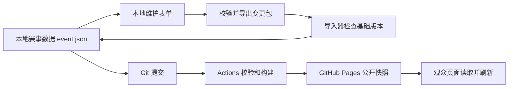

> **历史初版计划，不是当前操作手册。** 当前日常维护请阅读[维护操作手册](OPERATOR_GUIDE.md)，通过本地工作台完成录入、草稿、预览、发布与上线确认。本文“导出 JSON 后执行发布命令”等旧流程，以及旧页签、跨日第三轮和 10 场决赛描述，仅为历史记录。最新实现见[体验升级说明](EXPERIENCE_UPGRADE.md)，赛程与规则以 [docs 中的新资料](RULES.md)为准；完整文档入口见[文档目录](README.md)。

# RoboGame2026 赛程可视化工具实施计划

本计划用于让未参与前期讨论的 agent 从零实现一个美观、方便维护、适合手机查看的 RoboGame2026 赛事网站。网站读取比赛结果，计算瑞士轮评分、排名、后续对阵与决赛晋级，并清楚区分待确认信息和正式公布信息。首选 GitHub Pages 托管，采用本地录入、版本化数据、自动构建发布的方案。

本次交付范围是计划及赛程参考资料，尚未开发网站或创建远程仓库。执行本计划时，先阅读决策状态，再依次完成实施步骤，不要把尚未确认的产品假设当成用户已确认的要求。

## 1 项目状态和执行入口

| 项目 | 内容 |
| --- | --- |
| 当前工作目录 | `D:\Code\RG26` |
| 原始资料 | 根目录 `RoboGame2026赛程安排.docx` |
| 资料 SHA256 | `96C9C6B67CBD7E75E127D4126B36D166B583CB4F3DE6FD98AC532BD80BB18A47` |
| 阅读日期 | 2026-09-30 |
| 当前工程状态 | 规划开始时仅有 DOCX；没有 Git 仓库、应用代码、依赖或部署配置 |
| 参考文件 | `docs/reference/schedule-extracted.md`、`docs/reference/image1.png`、`docs/reference/image2.png` |
| 原文权威性 | 原文明确说明时间仅供参考，当天以赛程组共享文档安排为准；目前未提供该共享文档 |
| 用户明确需求 | 根据比赛结果更新、可视化、美观、维护简单、信息组织合理、手机方便查看；考虑 GitHub Pages |
| 规划成果 | 本文件应能独立说明业务规则、架构、交付物、执行顺序与验收条件 |

参考文件保留了原文段落序号和两张名单图片。提取文件中的数学公式是展开字符，分数及上下标结构不完整；准确公式以本计划第 5 节和 DOCX 的 OMML 为准。后续若原始文件哈希变化，应比对规则变化，不能继续声称与旧版文档完全一致。

执行 agent 的第一步：检查当前目录和适用的 AGENTS.md，保留已有工作；若项目已被其他人初始化，就在现有工程上继续，不得覆盖重建。以下文件路径均相对项目根目录，不能写死这台电脑的盘符。

## 2 决策状态与范围

### 2.1 已确认决策与默认方案

用户已明确选择“由少量维护者在本地录入，提交 GitHub 后自动发布”。另外两项尚未答复，按下表默认值继续规划；这两项默认值不是用户确认。若用户后续补充，应更新本节及受影响章节，然后执行。

| 决策 | 状态 | 采用方案 | 对实现的影响 |
| --- | --- | --- | --- |
| 谁录入及如何发布 | 用户已确认 | 少量维护者使用本地表单录入，提交 GitHub 后发布 | 无账号系统、无生产写入 API，Git 记录正式修改历史 |
| 更新速度 | 待确认，采用默认 | 允许确认成绩后几分钟内更新 | GitHub Actions 发布；观众页面定期检查新数据，不能承诺秒级到账 |
| 排位赛最优成绩与同分规则 | 待补充，采用默认 | 录入裁判确认的 1 至 22 名最终名次 | 不推测按积分、用时、三审排名等自行打破同分 |

其他默认约定：中文界面；比赛日期采用 2026 年 10 月 3 日和 4 日；时区为 `Asia/Shanghai`；公开只读；单一值班发布者；没有队伍标识图片时使用队名和编号；不依赖外部字体、统计脚本或运行时 CDN。年份来自文档标题，时区是当前产品假设，均放入配置。

尚需在正式运营前补齐的资料：赛程组共享文档地址或确认后的最新安排、真实场地名称、GitHub 仓库及所有者、是否公开原始 DOCX、名单文字核对、展示组决赛抽签顺序。缺少这些资料不妨碍本地开发，使用明确的待定值，不虚构。

### 2.2 第一版必须完成

1. 10 月 3 日和 4 日的完整赛程，包含比赛、核分、展示、抽签、开幕式和表演赛。
2. 22 队两轮排位赛成绩展示和正式排名录入。
3. 16 队瑞士轮的战绩分组、评分计算、轮次确认、对阵发布和跨日锁定。
4. 八强决赛的指定对阵关系、胜败流转、两组 BO3 和最终名次。
5. 队伍搜索、详情、后续比赛定位及本机关注。
6. 本地维护工具：录入、校验、预览、确认、导入导出、发布前检查。
7. GitHub Pages 工作流、数据更新提示、读取失败处理和维护文档。

第一版不实现逐秒现场计分、多人同时编辑、登录权限系统、裁判流程平台、机器人遥测、自动抓取不明共享文档、推送通知、自动重新排定整天时间或通用赛事配置平台。后续确有需要时，保留数据接口接入后台。

### 2.3 GitHub Pages 选择结论

GitHub Pages 可以托管 HTML、CSS、JavaScript 静态网站，适合本项目的公开阅读页面。浏览器仍能进行搜索、筛选、计算、图表和数据刷新；托管静态文件不意味着界面不能交互。[GitHub Pages 官方说明](https://docs.github.com/en/pages/getting-started-with-github-pages/what-is-github-pages)

GitHub Pages 本身不提供本项目所需的服务端写入逻辑。第一版通过本地录入、Git 提交和 Actions 部署发布数据。GitHub Free 可用于公开仓库；若计划使用私有仓库，应确认账户方案，不能假设私有仓库对应的网站天然私有。[可用仓库与账户方案](https://docs.github.com/en/pages/getting-started-with-github-pages/what-is-github-pages)

使用自定义 Actions 工作流可避免 Pages 默认每小时 10 次构建软限制的适用情形，但依然存在部署耗时、平台配额和缓存传播，不能承诺固定延迟。官方列出的发布站点大小上限为 1 GB、月带宽软限制为 100 GB；本项目应远低于这些规模。[GitHub Pages 限制](https://docs.github.com/en/pages/getting-started-with-github-pages/github-pages-limits)

如果用户选择网页登录录入或要求 10–30 秒内可靠传播，应调整为“静态前端 + 受鉴权的结果服务”。保留规则模块和读接口，但另行明确账号、数据库、写权限、并发版本检查与部署位置，再实现后台，不能在公开页面内嵌 GitHub 写入令牌。若用户提供共享表格，应先取得实际列名、权限和结果确认字段，设计显式适配器，不直接猜测抓取规则。

## 3 已确认的参赛结构

### 3.1 名单与身份

有 22 支竞技组队伍和 3 支展示组队伍。竞技组的三审排名、队伍编号、排位赛最终名次是三个不同字段。竞技组与展示组编号会重复，因此全局 ID 必须带组别，例如 `competitive-18` 和 `showcase-1`。

竞技组三审顺序及编号如下。队名来自原文图片的人工初读；建立种子数据时必须逐项对照 `docs/reference/image1.png`，特别核对特殊字、空格及字母大小写。对无法确认的名称，临时显示“竞技组 N 号队”，保留待核对标记；不得为方便而改成虚构队名。

| 三审排名 | 队伍编号 | 队名初读 |
| --- | --- | --- |
| 1 | 18 | Uniforest队 |
| 2 | 4 | 机器曼妙队 |
| 3 | 5 | 保卫萝卜队 |
| 4 | 14 | All Last队 |
| 5 | 35 | 沫日堡垒队（首字需核对） |
| 6 | 1 | 萝卜施工队 |
| 7 | 10 | 吃饭要排队 |
| 8 | 23 | 组一辈子战队 |
| 9 | 6 | 肥西路奶龙拆迁大队 |
| 10 | 28 | 拼好队 |
| 11 | 2 | 瀚风点火队（首字需核对） |
| 12 | 21 | 西餐不好吃队 |
| 13 | 25 | 黄瓜同好会 |
| 14 | 17 | 我也要打rg吗，队（字母及空格需核对） |
| 15 | 13 | 名字够长就一定会有人看队 |
| 16 | 27 | Rg小队（字母大小写需核对） |
| 17 | 3 | 少微摸个鱼队 |
| 18 | 9 | 超时空辉月机队 |
| 19 | 31 | 啊对对队 |
| 20 | 12 | 萝卜给猫队 |
| 21 | 29 | iRunTV队 |
| 22 | 8 | AAA平地起高楼施工队 |

展示组按编号 1、2、3 预演，名称初读为“晓啸启宇队”“Aura-Bot”“海底小纵队”；对照 `docs/reference/image2.png` 核对。决赛演出顺序由抽签决定，不能直接沿用编号或预演顺序。

### 3.2 赛段与比赛数量

| 赛段 | 规则 | 正常赛程数量 |
| --- | --- | --- |
| 排位赛 | 22 队各跑两轮，取最优成绩排 1–22；前 16 晋级 | 44 次单队跑图 |
| 瑞士轮 | BO1，3 胜晋级、3 败淘汰；5 轮最多 | 8 + 8 + 8 + 6 + 3 = 33 场 |
| 决赛 | 初始胜者组 4 队、败者组 4 队，按文档指定图流转 | 8 场 BO1 + 2 组 BO3 |
| 两组 BO3 | 每组先赢 2 局者胜，2–0 时结束 | 合计 4–6 局 |
| 展示组 | 3 场预演、3 场正式演出 | 6 个日程活动 |
| 表演赛 | 总决赛后按通知进行，15 分钟 BO2 | 独立活动，不影响冠军归属 |

正常完成时，竞技比赛局数为 44 + 33 + 8 + 4–6 = 89–91，排除表演赛。UI 的计数要区分“跑图次数”“对阵/系列赛数量”“已打小局数”，不能把 BO3 当成固定三局，不能把占位小局算成已完成。

## 4 日程数据的完整基线

所有时间使用带偏移的 ISO 8601 值存储，例如 `2026-10-03T09:00:00+08:00`。显示始终按赛事时区，不能跟随访问者所在时区改变官方赛程。时间来源标记为“原始计划”，首页保留“以现场通知为准”。

### 4.1 10 月 3 日

| 时间 | 内容 | 生成与显示规则 |
| --- | --- | --- |
| 09:00–10:50 | 排位赛第一轮 | 两场地并行，11 批，每批 10 分钟 |
| 10:50–11:10 | 展示资料对接 | 提醒 PPT、视频、动画等交接 |
| 11:10–11:55 | 展示预演 | 按展示组编号 1、2、3，各 15 分钟 |
| 12:00 | 展示组抽签 | 主席台前，结束时间未给出 |
| 13:30–15:20 | 排位赛第二轮 | 同顺序，上午下午互换场地 |
| 15:20–16:00 | 排位赛核分及准备 | 正式公布排名与十六强对阵 |
| 16:00–17:20 | 瑞士轮 R1 | 8 场，每场 10 分钟，逐场进行 |
| 18:30–19:50 | 瑞士轮 R2 | 1–0 组 4 场，0–1 组 4 场 |
| 19:50–20:10 | 核分及发布 R3 | 一次发布第三轮全部 8 场 |
| 20:10–20:30 | R3 的 2–0 组 | 2 场，产生两支 3–0 晋级队 |
| 20:30–20:50 | R3 的 1–1 组前半 | 前 2 场 |

排位赛第 `b` 批，`b=0..10`：三审第 `2b+1`、`2b+2` 名同时上场，首轮开始时间为 09:00 加 `10b` 分钟，次轮为 13:30 加 `10b` 分钟。首轮奇数名到 A、偶数名到 B；次轮互换。A/B 是配置中的临时场地名，这个具体左右指派是实现约定，文档只要求并行和互换。

### 4.2 10 月 4 日上午

| 时间 | 内容 | 生成与显示规则 |
| --- | --- | --- |
| 09:00–09:20 | R3 的 1–1 组后半 | 第 3、4 场，沿用前一晚已公布对阵 |
| 09:20–09:40 | R3 的 0–2 组 | 2 场，产生两支 0–3 淘汰队 |
| 09:40–10:00 | R3 核分、公布 R4 | 完整 R3 结束后才可计算 R4 |
| 10:00–11:00 | R4 | 2–1 组 3 场、1–2 组 3 场 |
| 11:00–11:20 | R4 核分、公布 R5 | R4 共 6 场全部确认后执行 |
| 11:20–11:50 | R5 | 2–2 组 3 场 |
| 11:50–12:00 | 瑞士轮总核分 | 统一计算最终评分、胜败者组和决赛种子 |

正常情况下，10 月 3 日打 20 场瑞士轮，10 月 4 日上午打 13 场。瑞士轮虽然排位赛有两个场地可用，但文档明确此赛段逐场进行，不得自动改为并行。

### 4.3 10 月 4 日下午及决赛图

下表的比赛 ID 是实现要求，UI 可另用简洁中文名称。`winner(X)` 和 `loser(X)` 是依赖关系，不是初始化时就能写死的队伍。

| 时间 | ID | 对阵或活动 | 赛制 |
| --- | --- | --- | --- |
| 14:00 起 | opening | 开幕式，比赛安排 14:30 起 | 活动 |
| 14:30–14:40 | F-L1A | L1 对 L4 | BO1 |
| 14:40–14:50 | F-L1B | L2 对 L3 | BO1 |
| 14:50–15:05 | showcase-final-1 | 抽签第 1 队正式演出 | 活动 |
| 15:05–15:15 | F-W1A | W1 对 W4 | BO1 |
| 15:15–15:25 | F-W1B | W2 对 W3 | BO1 |
| 15:25–15:40 | showcase-final-2 | 抽签第 2 队正式演出 | 活动 |
| 15:40–15:50 | F-L2A | loser(F-W1A) 对 winner(F-L1B) | BO1 |
| 15:50–16:00 | F-L2B | loser(F-W1B) 对 winner(F-L1A) | BO1 |
| 16:00–16:15 | showcase-final-3 | 抽签第 3 队正式演出 | 活动 |
| 16:15–16:25 | F-LSF | winner(F-L2A) 对 winner(F-L2B) | BO1 |
| 16:25–16:35 | F-WSF | winner(F-W1A) 对 winner(F-W1B) | BO1 |
| 16:35 起 | F-QUAL | winner(F-LSF) 对 loser(F-WSF) | BO3 |
| F-QUAL 后 | F-GF | winner(F-WSF) 对 winner(F-QUAL) | BO3 |
| 总决赛后，待通知 | exhibition | 15 分钟 BO2 表演赛 | 不计正式排名 |

文档给出的 BO1 两场时间块按每场 10 分钟细分是本计划的日程实现约定；同一时间块内的上述对阵先后以附一列出顺序初始化，可由组委会修订。BO3 没有给出固定结束时刻，不应编造总决赛的准确开始或结束时间。使用 `afterSeriesId` 表示依赖，显示“名额争夺战结束后”。

> **口径更新（2026-10-03，赛程时间）：** `afterSeriesId` 只表示真实依赖，**不能**再当成"这两场没有时间"的理由——把时间块起点照抄给三场（16:35 / 16:35 / 16:35）会让观众以为它们同时开赛。现在按手册自身的量铺开成固定时段：名额争夺战 16:35–17:05、总决赛 17:05–17:35、表演赛 17:35–17:50（依据：每场 10 分钟 + 两组 BO3 合计最多 6 局 + 表演赛 15 分钟 BO2）。`plannedEnd` 记计划时段，实际结束以赛况为准。同时修正排位赛核分时段为手册的 15:20–15:40（原为 15:20–16:00）。见 [RULES.md 赛程时间基线](RULES.md#赛程时间基线) 与 [本次验收记录](acceptance/2026-10-03-final-block-times.md)。

## 5 比赛与评分规则

### 5.1 排位赛

保留 44 条跑图记录，字段至少有队伍、轮次、场地、计划时间、执行状态、原始结果、裁判备注及成绩确认状态。原文未规定原始成绩结构与最优比较规则，默认允许保存结果文字和可选积分/用时，但它们不参与自动确定排位名次。

> **口径更新（2026-10-03）**：组委会已确认同分口径——**积分高者优；积分相同时到达最终分时间早者优**；积分与用时因此**参与**排位名次比较。名次还必须在成绩完整后由维护者**显式定榜**，不得因一次成绩录入自动产生正式名次。见 [RULES.md 排位赛定榜门禁](RULES.md#排位赛定榜门禁) 与 [本次验收记录](acceptance/2026-10-03-qualification-ranking-gate.md)。

维护者录入裁判确认的 1–22 名最终排序，同时记录公布时间和来源说明。正式确认前必须验证：22 队完整出现且只出现一次，排名连续且唯一。不得使用三审排名代替排位赛排名。两轮最优成绩的自动选取在规则补齐后再增加；当前展示“裁判确认的最优成绩”。退赛导致名单不足时，进入异常处理，不擅自补位。

### 5.2 瑞士轮结果的两种统计集合

瑞士轮每场必须有明确胜者，不允许平局。胜者由裁判确认，不能仅凭积分高低自动推断，除非后续补充规则明确允许。把建议胜者与正式胜者分开。

对每队：

- `n`：计入得分表现的有效比赛数量。
- `m`：已结算并登记的对阵数量，包括原文规定的未开赛弃权和行政判负中止。
- `W`、`L`：上述对阵的胜负数量。
- `s_k`、`o_k`：第 k 场本队、对方最终有效原始积分，不能提前封顶写回原始数据。
- `d_k = s_k - o_k`。
- `t_k`：开赛后首次达到最终有效积分的时间，建筑须经稳定确认；最终积分为 0 时记 360 秒。

“登记对阵”按已经确认结果的有效对阵计入本次结算；下一轮仅公布但尚未完赛的配对不提前计入 O。这个解释应在维护说明里写明，并在组委会有不同解释时调整规则版本。

原文规定的有效正常比赛、按规则提前结束的有效比赛：双方计入表现统计、战绩和 O。未开赛弃权、行政判负中止：双方都不计入 A/B/P/T，但胜负和登记对阵仍计入战绩及 O。缺分缺用时不等于 0，不得用假 0 分填补缺失数据。重赛只纳入最后有效的那一次，旧记录保留且标为被取代。

### 5.3 公式

下列公式已对照 DOCX 内置数学结构读取，直接按此实现：

```text
meanScore = sum(s_k) / n
meanDiff  = sum(s_k - o_k) / n
T         = sum(t_k) / n

A = (100 / n) * sum(min(s_k, 16) / 16)
B = (1 / n) * sum(50 + 5 * clamp(s_k - o_k, -10, 10))
P = (A + B) / 2

v_j = W_j / (W_j + L_j)
q_j = 50 * v_j + 0.5 * P_j
O   = (1 / m) * sum(q_j for each settled registered opponent occurrence)
R   = 0.6 * P + 0.4 * O
```

先计算所有队伍的 P 和 v，再遍历对手记录计算 O、R；O 不依赖对手的 O 或 R。与同一对手多次对阵，就按每场分别计入，不把对手集合去重。

边界值：`n=0` 时 A、B、P 为 0，T 为 360；没有胜负记录时 v 为 0；`m=0` 时 O 为 0。局均原始得分和原始分差在 n=0 时显示“—”，原文没有规定其默认值。A、B、P、O、R 均在 0–100 之间。

提前晋级或淘汰后，该队 P、W、L 不会因停止参赛而被清零，其 O 和 R 仍会随历史对手后续成绩更新。因此两支 3–0 队不能在 R3 当晚就永久确定 W1/W2；最终种子要等 R5 全部结束后统一计算。

输入积分与秒数用规范化非负十进制字符串存储并保留实际精度，拒绝负数、非数字和非有限值，不能把原始积分上限设为 16。时间大于 360 秒可提示复核，但原文未明确时间字段总范围，不能据此擅自新增硬性判罚。零分有效局强制应用 360 秒约定。计算时转为有理数，不先格式化后计算。

### 5.4 排序与配对

同战绩组依次按 R 降序、P 降序、T 升序、排位赛最终名次升序排序。比较原始计算精度，展示时保留两位小数。不得用页面显示的四舍五入值排序，不增加未规定的“直接交手”“净胜分优先”等规则。

在独立的 `domain/rational.ts` 中实现本项目需要的小型有理数运算：规范化的 BigInt 分子/分母、十进制字符串解析、加减乘除、比较、显示格式化。公式里的 0.6、0.4、0.5 分别使用 3/5、2/5、1/2。比较用交叉相乘，展示阶段才保留两位小数；序列化时把分子/分母转为字符串，不能直接 JSON.stringify BigInt。不实现通用数学框架，不用任意 epsilon 把不等值强行视为相等。

R1：按正式排位 1 对 16、2 对 15，依次到 8 对 9。R2 起：按相同战绩分组、组内按上述规则排序，依次第 1 对第 2、第 3 对第 4，直到结束。原文没有“避免重复对阵”，因此不实现自动避重、跨组调队、随机配对或轮空规则。

配对组顺序按赛程初始化：R2 为 1–0、0–1；R3 为 2–0、1–1、0–2；R4 为 2–1、1–2；R5 为 2–2。每个组内的场次顺序就是排序后的相邻配对顺序。

每一轮全部结束且确认后才生成下一轮正式候选。正常场次预期为 `[8,8,8,6,3]`，不能为了凑数伪造比赛。如果退赛等使某组人数为奇数、名单异常或名额变化，停止自动配对并显示原因，允许有说明的组委会修订。

R3 是一轮 8 场，按 `[2–0 两场, 1–1 前两场, 1–1 后两场, 0–2 两场]` 映射到两天的日程。必须在 R2 确认后一次性发布全部对阵和时间槽；不得 10 月 4 日早上根据前晚四场结果重新排序剩余四场。

### 5.5 八强种子与淘汰

最终战绩组顺序：3–0、3–1、3–2、2–3、1–3、0–3。正常队数分别为 2、3、3、3、3、2。最终同组排名使用 R5 结算数据。

- 3–0 组前两队：W1、W2。
- 3–1 组前两队：W3、W4；该组第三队：L1。
- 3–2 组三队：L2、L3、L4。

决赛对阵依第 4.3 节固定图实现，不套用通用双败库的默认赛程。这是从瑞士轮分配胜败者组开始的特定赛制；文档没有总决赛重置，F-GF 只打一组 BO3。

F-L1A/F-L1B 的败者及 F-L2A/F-L2B 的败者结算“八强”；F-LSF 败者结算“四强”；F-QUAL 败者为季军；F-GF 败者为亚军、胜者为冠军。排位赛第 17–22 为“优秀奖”，瑞士轮淘汰者为“十六强”。不得为并列奖项编造精确第 5–8 名。

BO3 小局与系列赛分开记录。每局确认胜者后累加系列赛比分，先达到 2 胜即结束；2–0 后第三局标为“不需要进行”，不能当作 0–0 未完赛。不能在系列赛尚未产生胜者时向下游推进。

## 6 正式状态和更正机制

### 6.1 分开三个维度

`executionStatus` 表示现场进程：scheduled / ready / running / finished / delayed / cancelled / not-needed。`resultStatus` 表示结果：none / provisional / confirmed。`publicationStatus` 表示轮次或种子的公布：draft / published / superseded。

维护工具中的草稿只保存在本机；正式站点的数据只能来自通过校验并发布的快照。观众可看到明确标注的“待确认成绩”，但它不能参与正式配对或晋级。当地时间经过计划开赛点，不得自动把比赛标成正在进行或已结束。

### 6.2 轮次确认与冻结

每轮保存：轮次 ID、matchIds、输入截止轮次、该轮结果版本、确认时间、配对所依据的评分快照、配对版本、公布时间、分组与槽位。把“当前参考排名”和“已用于正式配对的排名”分开。

维护流程为：录入成绩 → 单场确认 → 全轮校验与确认 → 生成下一轮候选 → 检查 → 公布并冻结。网站可以自动算出候选，但不能因为一次输入保存就自动对外宣布新的对阵。

### 6.3 更正与已公布的比赛

每次更正记录原因、修改时间、旧值、新值和受到影响的对象；工作人员姓名不要求出现在公开快照里。Git 保留正式版本历史，本地表单操作记录不等同于线上发布成功。

1. 下游尚未发布：重算评分并重建候选，作废旧候选。
2. 下游已发布但未开赛：先显示受影响范围，要求维护者依据裁判/组委会决定选择“保留已公布对阵并说明”或“作废旧版本并重新公布”。没有处置记录时阻止导出正式版本。
3. 下游已经开赛或有有效结果：保持已经发生的参赛双方和比赛记录，不能静默把旧比分移给另一支队。标记依赖不一致并阻止自动推进；记录组委会修订结果后才可恢复发布。

瑞士轮评分跨队伍依赖历史对手，应重算该截止轮次的全部队伍，再比对所有后续已公布轮次和最终种子；不能只检查两支被更正队伍的直接下一场。决赛则沿 winner/loser 依赖图检查全部受影响下游。

采用一个新的赛事数据版本整体保存更正和处置，不留下“新比分配旧种子但无说明”的半状态。取消、重赛和行政结果用明确类型表达；不要删除历史数据后假装从未发生。

## 7 信息结构与视觉设计

### 7.1 页面入口

| 入口 | 核心问题 | 主要内容 |
| --- | --- | --- |
| 总览 `#/` | 现在是什么情况，接下来是什么 | 赛事状态、正在进行、下一批比赛、关注队伍、最新通知 |
| 赛程 `#/schedule` | 某天、某队、某场地何时比赛 | 日期切换、赛段和场地筛选、分组时间线 |
| 晋级 `#/progress` | 谁晋级了，下一轮怎么打 | 排位赛、瑞士轮、决赛三个视图切换 |
| 队伍 `#/teams` | 找到某队及其参赛历程 | 搜索、组别筛选、编号与队名、当前赛段状态 |
| 队伍详情 `#/teams/:id` | 该队成绩和下一场是什么 | 下一场、历史比赛、成绩详情、晋级路径、关注按钮 |
| 比赛详情 `#/matches/:id` | 对阵、结果和依赖是什么 | 场地、时间、状态、双方分数/时间、异常说明、上下游链接 |
| 规则 `#/rules` | 排名如何计算，时间是否准确 | 通俗解释、公式、统计口径、当前规则版本、资料来源 |

手机底部使用“总览 / 赛程 / 晋级 / 队伍”四项导航，规则和说明放顶部菜单。桌面使用顶部导航。筛选写入 hash 内的查询参数，例如 `#/schedule?date=2026-10-04&team=competitive-18`，分享后可以恢复，不依赖服务端路由重写。

### 7.2 视觉方向

采用清晰的赛事信息风格：浅灰背景、深蓝正文、蓝色交互强调、小面积状态色。优先让队名、时间和成绩易读，不做占满首屏的宣传横幅，不使用无意义图表或装饰性计数器。

| 项目 | 设计基线 |
| --- | --- |
| 背景 / 面板 | `#F4F6FA` / `#FFFFFF` |
| 正文 / 辅助文字 | `#142033` / `#5C687C` |
| 主交互色 | `#2457E7` |
| 晋级 / 待确认 / 淘汰 | 分别使用绿、琥珀、灰色并配明确文字 |
| 字体 | 系统中文无衬线字体栈；比分与时间用 tabular-nums |
| 文字尺寸 | 手机正文 16px，辅助 13–14px，标题 20–28px |
| 间距 | 4/8/12/16/24/32px 统一尺度 |
| 卡片 | 12–16px 圆角、细边框、克制阴影；列表保持紧凑 |
| 内容宽度 | 桌面最大约 1200px；手机左右留 16px |
| 动效 | 仅短淡入、展开；支持 prefers-reduced-motion |

颜色只是初始 token，最终必须检查对比度。用语义 HTML、清晰焦点和键盘操作；正常文字对比度目标至少 4.5:1。状态不能只靠颜色，图标均有文字或可访问名称。

### 7.3 各赛段如何呈现

排位赛：桌面展示排名、队伍、第一轮、第二轮、正式最优成绩、晋级状态；手机用每队一行摘要，可展开两轮详情。三审顺序用于“出场安排”，不要和正式排名列混淆。

瑞士轮：每轮显示战绩分组和对阵卡片，例如“2 胜 0 负 · 本组获胜即晋级”。赛中列表可展示参考战绩，但正式轮次评分标明“截至 R2 已确认成绩”。排名默认只显示名次、队伍、战绩和 R；展开再看 A/B/P/O/T、原始平均得分、分差及算法解释，手机不堆满九列表格。

决赛：桌面绘制固定 winner/loser 流向图，节点就是可点击比赛卡，连接线用轻量 SVG/CSS。手机默认按“八强败者组首轮 → 八强胜者组 → 败者组第二轮 → 两场半决赛 → 名额争夺战 → 总决赛”的实际比赛顺序展示纵向卡片，可切换“完整对阵图”在独立容器里缩放或横向滚动。整个页面不应横向溢出。未知队伍显示“F-W1A 败者”等来源，而不是一律显示 TBD。

队伍详情在 375px 宽度下也应完整显示最长队名，允许两行；比分不被长队名挤出屏幕。展示组详情显示预演、资料对接、抽签和正式演出，不出现竞技组的胜负排名。

### 7.4 当前赛况、空状态与手机体验

首页优先展示显式标记 running 的比赛；多个并行比赛同时展示。没有正在进行的项目时显示下一计划项目；已过计划时间但未更新状态时标明“等待现场确认”，不要显示负数倒计时。

赛前显示首日安排和开赛日期；赛中优先今日；正式结束后显示最终结果和两日归档入口。赛事是否结束依据已确认结果或显式赛事状态，不仅依据当前日期；时间已过去但没有成绩时显示“结果待发布”，不能生成虚假冠军。默认日期必须能容纳当前时间不在赛事两天内的情形，不能打开空白“今天”。

空状态分别说明“尚未比赛”“待裁判确认”“等待上一轮结束”“等待抽签”“该筛选没有结果”“无法获取最新数据”。触控目标至少 44×44px；底栏考虑安全区；点击筛选不使列表跳回顶部；刷新数据保留路由、日期、筛选和滚动位置。

关注队伍只存本机，可选多队；关闭或清理浏览器存储会丢失。复制队伍或比赛链接应可用，并有复制失败时的文本替代。页面明确显示赛事数据更新时间和最近成功检查时间，二者不要混为一谈。

## 8 技术架构与工程约定

### 8.1 技术栈

建议 React + TypeScript + Vite，使用 CSS Modules 和共享 CSS 变量。路由使用成熟的轻量 hash 路由实现，例如 React Router 的 HashRouter；结果与规则使用 Zod 或同类 schema 校验；领域逻辑不依赖 React。测试用 Vitest 和 Playwright。

不需要 Next.js 服务端渲染、数据库、图表平台、全局 Redux 或可拖拽流程图编辑器。固定决赛图采用普通布局和 SVG 连线即可。组件库如确需引入只用于无障碍基础组件，不让大型后台模板决定观众页面。

实施时选择相互兼容的稳定版本，提交锁文件；Node 使用届时支持且满足 Vite 要求的 LTS，写入 `.nvmrc` 和 `package.json#engines`，CI 使用同一版本。不要在本计划里把尚未核实的未来版本号写死。安装和使用方法以各工具当时的官方文档为准。

### 8.2 数据流



浏览器公开页面不写仓库。输入记录是事实来源，评分与晋级是派生结果，已公布对阵另存不可静默变化的快照。维护表单与构建脚本调用同一套规则函数，避免前后计算公式不一致。

### 8.3 目标目录

```text
RG26/
  RoboGame2026赛程安排.docx
  docs/
    IMPLEMENTATION_PLAN.md
    RULES.md
    OPERATOR_GUIDE.md
    DEPLOYMENT.md
    reference/
  data/
    event.json                 # 唯一正式输入文件，允许未完成赛事状态
  src/
    app/                       # 路由、布局、主题
    components/                # 队伍标签、比分、状态、空态、筛选
    pages/                     # 总览、赛程、晋级、队伍、规则
    domain/
      schema.ts
      rational.ts
      scores.ts
      standings.ts
      swiss.ts
      finals.ts
      corrections.ts
      validation.ts
    data/                      # 数据读取、校验、缓存、版本切换
    operator/                  # 仅本地维护模式加载
    styles/
  scripts/
    seed-event.ts
    validate-data.ts
    import-event.ts
    build-public-data.ts
  public/
    data/                      # 生成产物，不作为第二份手工数据源
  tests/
    fixtures/                  # 合成结果，仅用于测试与开发演示
    domain/
    e2e/
  .github/workflows/
    ci.yml
    deploy.yml
  README.md
  package.json
  package-lock.json
  vite.config.ts
```

所有正式数据更新最终写回 `data/event.json`；不要手工同时维护 JSON、CSV、Markdown 表格和前端常量。原始 DOCX 和参考图片不自动复制到公开产物；只发布指定的公开数据。

初始化时，44 次排位跑图可直接绑定真实队伍；33 个瑞士轮时间槽先只记录轮次、战绩组、组内序号和时间，尚未产生的对阵引用为空。每轮正式公布后再绑定实际比赛 ID 和参赛队伍。决赛可预建第 4.3 节的 10 个系列赛节点，队伍来源仍使用引用。不要为了补齐初始化数据而预演真实赛果。

## 9 数据契约

### 9.1 赛事顶层结构

以下为结构约定，不是完整可运行的初始 JSON。执行 agent 应实现严格 schema、初始化脚本及空赛果的完整种子数据。

```ts
type EventFile = {
  schemaVersion: 1;
  event: {
    id: 'robogame-2026';
    name: string;
    timezone: 'Asia/Shanghai';
    dates: string[];
    sourceDocumentSha256: string;
    officialScheduleUrl: string | null;
    scheduleNotice: string;
    contentUpdatedAt: string;
  };
  rules: {
    version: string;
    qualificationRankingMode: 'official-manual';
    swissPairingPolicy: 'same-record-adjacent';
  };
  teams: Team[];
  venues: Venue[];
  scheduleItems: ScheduleItem[];
  qualification: Qualification;
  swiss: { rounds: SwissRound[] };
  finals: { seeding: FinalsSeeding | null; series: Series[] };
  showcase: { drawOrder: string[] | null; confirmedAt: string | null };
  notices: Notice[];
  corrections: Correction[];
};
```

`schemaVersion` 用于数据结构迁移，`rules.version` 用于赛制变化，两者不同。公开快照外层包含 `revision`（输入内容哈希）、`builtAt`、`sourceCommit` 和 `schemaVersion`；不能让同一数据版本出现互相冲突的内容。没有真实赛果时结果数组为空或值为 null，不能用演示比分冒充事实。

### 9.2 主要对象

| 对象 | 必要字段与约束 |
| --- | --- |
| Team | id、division、number、name、nameVerified、thirdReviewRank；展示组无 thirdReviewRank |
| Venue | id、label、是否临时名称；排位赛至少 A、B，其余可以待定 |
| ScheduleItem | id、kind、stage、date、plannedStart、plannedEnd、afterSeriesId、venueId、referenceId、status、调整说明 |
| QualificationRun | id、teamId、round、scheduleItemId、status、rawResult、resultStatus、确认信息 |
| QualificationRanking | orderedTeamIds、bestResultLabels、status、confirmedAt、来源说明 |
| SwissRound | id、index、matchIds、pairingVersion、basedOnRound、basedOnRevision、publishedAt、closedAt、rankingSnapshot、修订说明 |
| SwissMatch | id、roundId、groupRecord、orderInGroup、slots、participantSnapshot、attempts、effectiveAttemptId、执行状态 |
| ResultAttempt | id、supersedesId、双方 teamId、score、finalScoreReachedSeconds、winnerId、resultKind、resultStatus、confirmedAt、note |
| FinalsSeeding | W1..W4/L1..L4 对应队伍、最终排名依据、版本、publishedAt |
| Series | id、format、slots、participantSnapshot、games、执行状态；胜者从有效且确认的小局推导 |
| Correction | id、reason、at、旧值/新值、affectedIds、处置方式、是否允许继续推进 |

结果类型使用枚举，例如 `normal`、`early-end`、`walkover-before-start`、`administrative-stop`，表现统计是否计入由类型推导，避免手工勾选组合产生相互矛盾的结果。重赛沿用原对阵，只改变有效 attempt；只有该 attempt 的结果计入统计。

计划时间、修订后的计划时间和实际时间分开，日程调整不破坏结果身份。无法确定的 end/time 用 null，依赖时间用 `afterSeriesId`，不能写一个随意的占位时刻。

### 9.3 对阵引用

```ts
type SlotRef =
  | { kind: 'team'; teamId: string }
  | { kind: 'qualification-rank'; rank: number }
  | { kind: 'finals-seed'; seed: 'W1' | 'W2' | 'W3' | 'W4' | 'L1' | 'L2' | 'L3' | 'L4' }
  | { kind: 'winner'; seriesId: string }
  | { kind: 'loser'; seriesId: string };
```

未公布前显示来源占位；公布或开赛后保存实际参赛队伍快照。依赖变化只能触发不一致提示和更正流程，不能自动重解释已经发生的比赛。图校验必须拒绝循环、未知来源、自我对阵和不存在的队伍。

### 9.4 规则模块接口

```text
validateEvent(event) -> errors, warnings
getEffectiveConfirmedResults(event, cutoffRound) -> result records
calculateSwissStandings(results, qualificationRanking) -> exact metrics + display metrics
generateSwissPairings(roundIndex, closedRoundSnapshot) -> ordered pairing proposal
confirmSwissRound(event, roundId) -> new event or structured validation errors
publishSwissPairings(event, proposal) -> new event with immutable pairing snapshot
assignFinalsSeeds(finalSwissSnapshot) -> W/L seed mapping
resolveFinals(event) -> series participants, wins, awards, dependency conflicts
previewCorrection(event, change) -> recomputed metrics + affected publications/results
buildPublicSnapshot(event) -> validated, sanitized, versioned public document
```

保持函数确定性；当前时间、随机数和浏览器存储由调用层传入，不隐藏在评分算法中。比赛 ID、队伍 ID 必须稳定，不根据当前数组索引、队名或结果重新生成。

## 10 维护者录入与发布流程

> 本节保留初版设计，以下导出、导入和手工发布步骤不再是当前日常流程。请直接按[当前维护手册](OPERATOR_GUIDE.md#quick-start)操作；工作台现已提供自动保存、观众预览与统一发布。

### 10.1 本地维护模式

提供 `npm run operator`，在 `127.0.0.1` 启动维护页面。可以复用 Vite 的独立 mode，但生产构建必须移除维护入口及代码分块，不能靠一个前端密码假装鉴权。公开站点没有结果写入能力。

维护页面能加载最新正式源数据或导入完整数据文件，显示基础版本。表单按当天赛程排序，并支持比赛 ID、队伍搜索。普通 BO1 一次录入双方积分、到达最终分时间、胜者、异常类型，提交前展示摘要。BO3 逐局输入，自动显示系列赛比分。

维护动作包括确认单场、确认整轮、生成/公布下一轮、确认排位排名、公布八强种子、登记抽签、调整时间和公告。所有操作先作用于本地草稿，预览时明显标记“未发布”。草稿保存失败（空间不足、禁用存储）要明确提示并允许立即导出文件。

### 10.2 导出和导入

表单导出 UTF-8 JSON 变更包：`{ schemaVersion, baseRevision, exportedAt, event }`。它是完整赛事版本，避免局部补丁丢失跨对象依赖。`baseRevision` 指打开时的正式源版本，不能在编辑途中随手替换成最新版本以绕过冲突。

提供命令 `npm run data:import -- --file <导出文件路径>`：检查 schema、基础版本和所有业务约束；展示修改摘要；校验成功后以临时文件加替换方式写入唯一源文件。基础版本不一致时拒绝覆盖，要求重新载入并人工合并，不提供默认 force 覆盖捷径。导入不自动执行 Git push。

公开快照与源文件可以结构不同，导入器只接受完整的源数据变更包，不接受公开页面的缓存文件冒充源数据。操作者应先同步仓库，再启动或重新载入维护工具；本地编辑期间同一赛事由一名值班维护者负责。

### 10.3 正常发布操作

维护手册至少解释以下完整链路：

1. 同步仓库，确认当前正式版本，启动维护工具。
2. 录入并确认比赛，查看排名/下一轮候选，必要时执行公布动作。
3. 导出变更包，运行导入命令，核对改动摘要。
4. 运行 `npm run validate:data` 及本地预览；检查受影响队伍和对阵。
5. 提交 `data/event.json` 的修改并推送到指定发布分支；提交信息说明轮次或更正原因。
6. 等待 Actions 部署成功，在公开页面核对 revision 和结果。导入完成、commit 成功、push 成功均不等于观众已看到更新。

首次配仓库时由执行 agent 完成本地准备和工作流，确认实际远程目标与已有授权后再推送/发布。本计划本身不是让规划阶段代替用户创建任意公开仓库的指令。运行中的数据发布沿用用户对维护流程的授权，不为每个普通赛果重复设计审批流程。

### 10.4 公网读取和缓存

构建生成单个 `data/event.json` 公开快照，包含一个完整的一致版本。每次读取先 schema 校验，再一次性替换前端状态，不能混用新 results 和旧 seeds。使用相对 base 拼接文件地址。

可见页面每 60 秒检查一次；回到前台与点击刷新时立即检查；隐藏页面暂停轮询，失败后退避到最多 5 分钟。使用 `fetch` 的重新验证缓存模式（例如 `no-cache`），保留服务器 ETag 能力。若实测无法满足新版本发现，再加按检查时间段变化的查询参数；说明这不能消除托管 CDN 本身的传播延迟。

仅在数据 revision 变化时替换赛事内容，避免列表闪动；revision 相同但 builtAt/sourceCommit 变化时，只更新发布元信息。校验失败、超时或网络错误保留最近一次成功快照，展示“暂时无法更新”和旧快照时间。首次读取失败且无缓存时显示重试入口。缓存写入失败不能影响正常在线浏览。

本机保存最近成功的数据快照用于临时读取失败；第一版不引入 Service Worker，因此不承诺断网后首次打开或冷启动一定可用。已打开页面在网络中断时仍能查看当前数据。回滚通过新 Git 提交发布，不用 reset 历史；客户端应接受内容哈希变回旧值但发布信息已更新的合法回滚，不能仅凭内容相同认定“已经检查过”。

## 11 GitHub Pages 部署

### 11.1 路径与构建

Vite `base` 根据真实部署目标配置。项目站 `https://<owner>.github.io/<repo>/` 用 `/<repo>/`，用户站或自定义域名根目录用 `/`；不要把当前目录名 RG26 擅自当成实际 repo 名。[Vite 官方 Pages 部署说明](https://vite.dev/guide/static-deploy.html#github-pages)

路由使用 hash，静态资源、图标和数据使用 Vite base；不用根路径 `/data/event.json` 写死请求。分别测试 `/` 和 `/test-repo/` 构建，打开和刷新队伍/比赛深链都应正常。`vite preview` 只用于本地构建检查，不作为生产服务器。[Vite 静态部署文档](https://vite.dev/guide/static-deploy.html)

### 11.2 CI 与发布流程

`ci.yml` 在 PR 上执行安装锁定依赖、类型检查、lint、领域测试、数据校验、构建和必要的端到端测试。`deploy.yml` 在发布分支 push 或手动 dispatch 时运行同样的必需检查，成功后才上传 dist 并部署。

GitHub 仓库 Settings → Pages → Source 选择 GitHub Actions。工作流使用官方 checkout、setup-node、configure-pages、upload-pages-artifact、deploy-pages；实施时核实对应版本并锁定版本或提交 SHA。部署权限至少包括 `contents: read`、`pages: write`、`id-token: write`，environment 为 `github-pages`。构建和部署分 job 时正确设置 `needs`。[GitHub Pages 自定义工作流](https://docs.github.com/en/pages/getting-started-with-github-pages/using-custom-workflows-with-github-pages)

按同一站点串行化部署，避免旧版本后完成而覆盖新版本；采用官方推荐的 concurrency 配置并验证连续两次更新的行为。PR 不直接发布到正式站点。数据校验或规则测试失败必须阻止部署。

部署后自动检查首页和公开 JSON 可读、版本一致；实际 Pages 子路径再手动检查一次。正常开发演示数据位于测试 fixture，不能打包成正式成绩。公网产物不得包括本地维护草稿、工作人员记录、仓库凭据或原始文档下载入口，除非用户要求公开这些资料。

### 11.3 现场可用性验证

发布前用实际观众设备和比赛场地网络检查首屏、刷新和深链。针对部署区域只报告实测，不保证 GitHub Pages 在所有网络都能稳定访问。如果实测访问质量不足，同一 dist 可迁移到另一个静态托管平台；届时由实际结果决定，不预先引入双平台维护。

## 12 实施顺序与阶段完成条件

| 阶段 | 要完成的工作 | 可检查的完成条件 |
| --- | --- | --- |
| P0 资料与决策 | 阅读本计划和原文；吸收用户后续答复；核对名单；登记假设 | docs/RULES.md 列出已知规则、未提供规则和安全默认；不会用虚构数据填缺口 |
| P1 工程与种子 | 建立 Vite/TS 工程、schema、初始化脚本、44 次跑图和日程 | 无赛果也能校验通过；22+3 队、日期时间、R3 跨日槽位准确 |
| P2 规则内核 | 瑞士评分/排序/配对、最终分组、决赛依赖、BO3、更正检查 | 第 13 节领域用例通过，公式与源文件示例一致 |
| P3 观众页面 | 实现路由、移动优先布局、赛程、晋级图、队伍和比赛详情 | 真实长队名、全空结果、部分赛果、赛事结束四类数据均可用 |
| P4 本地维护 | 录入、确认、快照冻结、导出导入、冲突检测 | 从本地表单输入到源数据更新再到公开预览形成完整闭环 |
| P5 更新与部署 | 数据读取/缓存/刷新、CI、Pages、路径测试 | 发布机制可重复执行；坏数据阻止发布；读取失败不清空旧内容 |
| P6 验收与交接 | 合成全赛程演练、手机/桌面 QA、操作者指南 | 一位未参与开发的人按手册能发布一场结果并完成一次更正 |

优先完成“录入一场 → 计算 → 本地预览”的纵向流程，再扩展全部页面，避免全部 UI 完成后才发现赛制无法表达。每阶段记录实际完成情况和未完成项，不因首页好看就宣称项目完工。

## 13 必须覆盖的验收用例

### 13.1 领域算法

| 编号 | 输入或操作 | 预期 |
| --- | --- | --- |
| D01 | 原文示例：本队 18、0，对手 12、10 | A=50，B=40，P=45；对手 v 为 0.5/1、P 为 60/70 时，q=55/85，O=70，R=55 |
| D02 | 得分超过 16、分差超过 ±10 | 只在每场 A/B 贡献中截断；原始分数和原始均值保留 |
| D03 | 零分有效局；无有效局；无对阵 | 时间分别按 360；A/B/P 与 O 的默认值符合第 5 节 |
| D04 | 未开赛弃权或行政判负中止 | 双方 n 不增加，但 W/L、m、O 正确增加；无虚假 0 分参与 P |
| D05 | 一场重赛，保存两次 attempt | 只有最终有效且确认的 attempt 进入战绩和指标 |
| D06 | 同组 R 很接近，显示均为同一两位小数 | 排序按原始精度；R 真相同时逐级比较 P、T、正式排位 |
| D07 | 同一对手出现两次 | O 按两次记录计入，不去重 |
| D08 | 队伍 3–0 后历史对手继续比赛 | 该队 W/L/P 保持，O/R 可以变化；最终 W1/W2 按 R5 决定 |
| D09 | R1 首尾配对，R2 以后同组相邻 | 严格执行，无自动避重或随机性 |
| D10 | R2 完成，发布 R3；前四场完成后跨日 | 次日四场参赛队及时间槽不变化，R4 仍不可生成 |
| D11 | 全赛程合成结果 | 5 轮 33 场；最终战绩组人数 2/3/3/3/3/2；W/L 各 4 队 |
| D12 | 决赛按映射推进 | 两场 L2 是交叉来源，第 4.3 节的对手对应准确 |
| D13 | BO3 2–0 与 2–1 | 分别有效 2/3 局；2–0 第三局不需要；只打一组总决赛，无重置 |
| D14 | 更正已确认瑞士成绩 | 重算全体 O/R，已公布对阵保持并出现需处置提示 |
| D15 | 更正决赛前置胜者且下游已开赛 | 不把旧下游比分归给新队，阻止自动流转并保留记录 |
| D16 | 缺积分、未知胜者、自我对阵、循环依赖、重复 ID | 按对象和字段给出可读错误；无法确认或发布 |
| D17 | 三审排名与排位赛名次不同 | R1 和所有排位同分比较使用正式排位，不使用三审顺序 |
| D18 | 退赛造成分组奇数 | 停止自动配对，要求组委会处置，不擅自轮空 |

完整赛程 fixture 使用固定合成输入，显式标注测试数据，保证可重复。不要随机生成结果后仅断言“运行未崩溃”；关键种子、配对和获奖队伍需要有独立预期。

### 13.2 用户流程与发布

1. 新观众打开手机页面，在首屏或一次点击内找到下一场；搜索长队名，打开详情并分享。
2. 排位赛同时两场能完整展示；展示组不会出现在竞技排名中；抽签未录入时不虚构演出队伍。
3. 一场成绩由草稿变为确认，正式对阵只有执行公布动作后变化；R3 跨日锁定完整演练。
4. 在两个本地标签页打开同一版本，先导入一份修改，再导入另一份，第二份被基础版本校验拒绝。
5. 源数据尚未完成赛事时构建成功；构造无效结果时 CI 拒绝；部分完成不被误判为非法。
6. 手机停留在某队详情时发布新数据，刷新后页面不跳走，结果更新；网络失败继续显示旧数据和时间提示。
7. 测试不兼容 schema、损坏 JSON、404、超时、首次无缓存及 localStorage 不可用。
8. 根路径和仓库子路径都能读取资源、数据和深链；浏览器刷新深链不会出现 GitHub 404。
9. 已公开的更正可追溯；回滚到已知正确源版本后重新部署，观众可看到回滚后的数据。
10. 公开构建不可进入维护模式，未携带用于写入仓库的凭据或本地草稿。

### 13.3 视觉和设备检查

至少检查 360、390、768、1440px 宽度，覆盖 Chromium 和 WebKit 能力范围；记录是否做过 iOS Safari、Android Chrome 和现场网络实机验证。自动模拟不等同于实机已验收。

验收要截图检查总览、长队名列表、R3 跨日赛程、瑞士轮详情、完整决赛图和手机纵向决赛。页面本体无横向溢出；没有仅 hover 可见的必要功能；200% 文本缩放下仍可操作；键盘焦点可见；减少动画设置生效。

以移动端生产构建测试为准，首页 Lighthouse 性能目标不低于 90、可访问性目标不低于 95；不能把单次分数当作现场速度保证。初始 JS gzip 目标约 200 KB 以内，公开数据目标 250 KB 以内；若超出，应解释必要性并检查是否错误打包维护模块或测试 fixture。

## 14 命令与交付清单

执行 agent 应提供下列 npm scripts，并保证 README 命令和实现一致：

```text
npm ci
npm run dev
npm run operator
npm run typecheck
npm run lint
npm run test
npm run test:e2e
npm run validate:data
npm run data:import -- --file <export.json>
npm run build
npm run preview
```

`build` 必须包含数据校验及公开快照生成，不允许忘记更新 public 数据。数据生成脚本只覆盖自己的生成目录；不要删除原文、参考资料、草稿或整个工作区。

| 交付物 | 内容 |
| --- | --- |
| 可运行源码 | 观众页面、领域模块、本地维护模式、严格数据 schema |
| 初始正式数据 | 真实队伍及完整时间槽，所有未发生结果为空 |
| 测试与 fixtures | 原文示例、完整赛程、异常、更正、路径与手机流程 |
| README.md | 如何安装、启动、测试、构建、了解当前完成状态 |
| docs/RULES.md | 与原文对应的公式、赛制、异常与未明确规则 |
| docs/OPERATOR_GUIDE.md | 单场录入、全轮确认、配对公布、抽签、更正、冲突、发布和回滚 |
| docs/DEPLOYMENT.md | 仓库、Pages 设置、base 配置、Actions、首次上线、排错及现场验证 |
| CI 与部署文件 | 正确的权限、检查、产物和串行部署策略 |
| 验收记录 | 执行过的检查、截图、浏览器及设备、未通过或未验证项 |

最终交接应报告实际实现与测试结果。没有部署凭据时交付可部署工程和确切剩余步骤；没有实机时报告模拟验证范围。不要把“已写工作流”称为“已上线”，也不要把可运行首页称为已完成全部赛制。

## 15 给执行 agent 的独立任务指令

> 请在当前工作区实现 RoboGame2026 赛程可视化工具。先读取本文件全部内容、根目录 `RoboGame2026赛程安排.docx` 和 `docs/reference/`。这是从零建立的中文赛事网站，以本计划已确认规则和最新用户答复为准。默认采用 React、TypeScript、Vite、纯静态 GitHub Pages、本地录入后通过 Git/Actions 发布。必须覆盖 22 队两轮排位赛、5 轮共 33 场瑞士轮、第三轮跨日冻结、文档定义的八强胜败者组和两组 BO3，以及 3 个展示组活动。严格实现评分和异常统计，不发明排位赛同分规则，不套用带总决赛重置的通用双败模板。按 P0–P6 逐步完成规则、页面、维护、发布及测试；按本文件第 13 节验收。保留原始资料和其他人的修改，只将已知真实数据用于正式站点。必要的缺失资料不能推测，但应继续完成不依赖它们的工作。最终交付源码、数据、维护手册、部署配置和真实验证结果。
