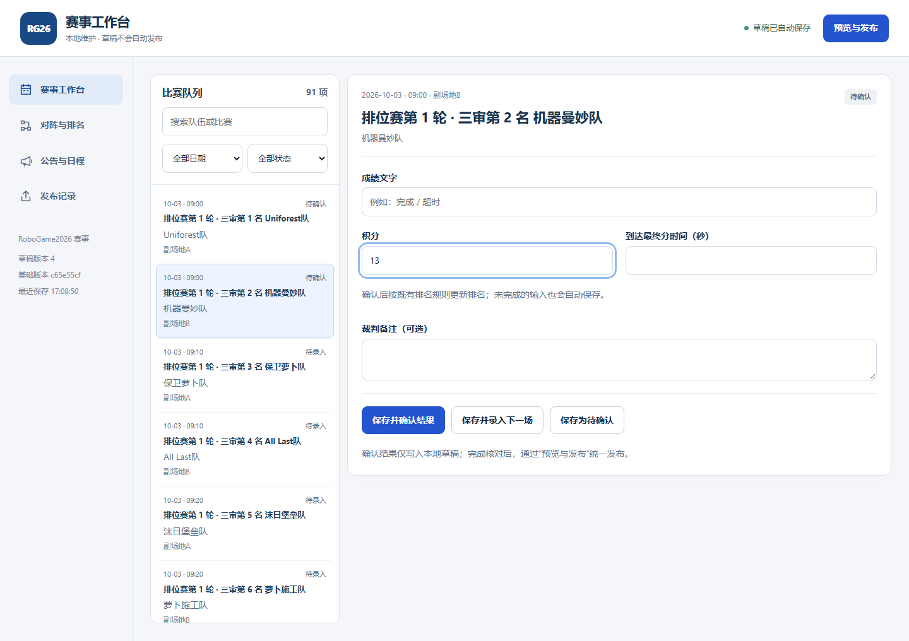
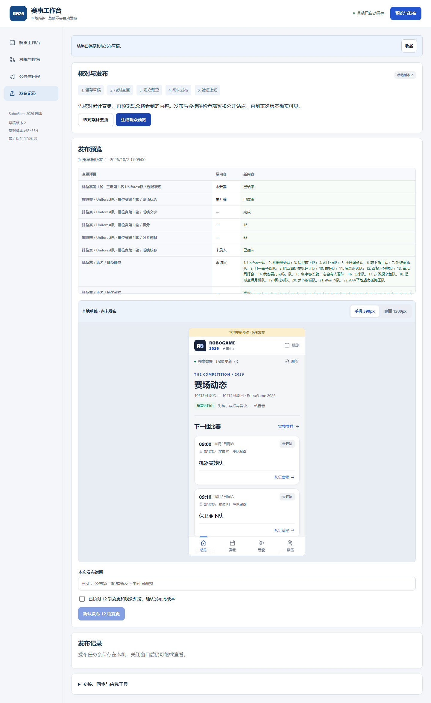

# 维护者操作手册

适用于 2026-10-02 升级后的本地赛事工作台。这是当前操作手册的统一入口，按钮名称与现有界面对应。日常更新全部在工作台完成，JSON 文件用于备份和交接，命令行发布留给技术维护者。

录入依据是本目录的 `RoboGame2026赛程安排（暂定） (1).docx` 和 `RoboGame2026 竞技组规则手册4_6.pdf`，根目录旧赛程仅作历史资料。赛制口径见 [规则与来源](RULES.md)，首次配置站点见 [部署说明](DEPLOYMENT.md)。

**最新约定（2026-10-02 用户确认）：决赛 BO3 全系列不换边，第一席位始终蓝方、第二席位始终红方。** 按本文和工作台当前标注录入；旧说明中的逐局换边要求已失效。瑞士轮仍按奇偶轮分配红蓝方。

<a id="quick-start"></a>
## 先完成一批结果更新

1. Windows 双击项目根目录的 `start-operator.cmd`，保留打开的终端窗口。
2. 在浏览器的“赛事工作台”选择日期、场次；BO3 还要选择具体小局。
3. 按裁判记录填写成绩，核对红蓝方和胜者，点“保存并确认结果”。继续录入其他场次，等右上角显示“草稿已自动保存”。
4. 点右上角“预览与发布” → “核对累计变更” → “生成观众预览”，检查手机、桌面下的显示。
5. 填写“本次发布说明”，勾选“已核对 N 项变更和观众预览，确认发布此版本”，点“确认发布 N 项变更”。
6. 在下方“发布记录”等到“观众已可见”，再点“打开观众站”核对结果。GitHub Pages 部署通常需要几分钟。

**“草稿已自动保存”只表示本机保存成功；“观众已可见”才表示本次发布版本已上线。** 页面上的“公布对阵”等操作也先进入草稿，仍须完成第 4–6 步。

按任务查找：[启动与更新工具](#startup) · [录入与更正](#results) · [排名、配对、改期](#planning) · [预览发布](#publish) · [故障恢复](#recovery) · [备份交接](#handover) · [技术命令](#cli)。

<a id="startup"></a>
## 1 启动、升级与入口

### 首次使用

需要安装 Git 和 Node.js，并由技术维护者配置 Git 提交身份及仓库推送权限。Node 版本按根目录 `.nvmrc`，当前推荐 Node 24，支持范围为 `>=22.12 <25`。

Windows 双击 `start-operator.cmd`：它会检查 Node 和 Git；缺少运行依赖时执行 `npm ci`，正常后自动打开工作台。启动器报错时保留窗口中的具体信息，按提示处理后重开。也可以在项目目录手动运行：

```powershell
npm ci
npm run operator
```

| 地址或命令 | 用途 |
| --- | --- |
| `http://127.0.0.1:5199/operator.html` | 本机维护工作台，浏览器未自动打开时手动访问这里 |
| `http://127.0.0.1:5199/` | 本机观众页面，不是录入入口，也不是草稿预览 |
| `npm run dev` | 观众站开发服务，不代替工作台 |
| [公开赛事网站](https://ablyh-leo.github.io/RG26/) | 给观众查看，不提供维护入口 |

关闭浏览器不会停止本地服务；关闭启动终端会停止它。已保存的输入和任务保留在本机，重启 `start-operator.cmd` 可恢复。维护地址只接受本机 `127.0.0.1` 访问，不要改成 `localhost` 或发给另一台电脑使用。

### 已有旧版工具时

启动器不会自动下载代码更新。先备份当前草稿并停止旧服务，让技术维护者在保留本地修改的前提下把 `main` 快进更新至最新版本、执行 `npm ci`，再重新启动。已有未发布草稿时先读[交接与冲突处理](#handover)，不要直接清空。

如果仍看到旧的“导出与发布”表单，先核对打开的是上述 `operator.html` 地址，以及运行的是否是最新工作区。当前界面应有以下四个入口：

| 左侧入口 | 可以完成的工作 |
| --- | --- |
| 赛事工作台 | 按日期和场次录入排位赛、BO1、BO3，处理更正和重赛 |
| 对阵与排名 | 排位赛排名、瑞士轮配对、八强种子、展示组抽签 |
| 公告与日程 | 添加公告、修订日程时间 |
| 发布记录 | 核对变更、预览、发布、查询上线、同步与交接 |

右上角的“预览与发布”和左侧“发布记录”进入同一个页面，页面标题为“核对与发布”。

<a id="saving"></a>
## 2 三种保存状态

| 看到的状态或操作 | 实际含义 | 观众是否看到 |
| --- | --- | --- |
| 输入自动保存／草稿已自动保存 | 未填完的字段也存到本机；按场次、小局分别保存 | 否 |
| 保存并确认结果 | 校验通过，裁判确认结果进入待发布赛事草稿 | 尚未看到本次修改 |
| 观众已可见 | 本批冻结版本已经提交、推送、部署并核对公开数据 | 是 |

切换比赛、切换 BO3 小局和刷新页面，可以恢复已经自动保存的字段；关闭窗口前等到“草稿已自动保存”。“有待保存输入”“正在保存…”或错误提示都不代表已完成保存。保存失败时使用“备份此窗口草稿”，按[故障恢复](#recovery)处理。

未完成输入不会冒充已确认赛果，发布其他场次也会保留它们。草稿、输入缓存及发布任务保存在 Git 忽略的 `.local/operator/`，不会随推送到达另一台电脑，也不进入观众网站。正式数据源是 `data/event.json`，工作台直接读取它；不要用 `npm run data:seed` 重置正在使用的赛事。

<a id="results"></a>
## 3 录入结果、更正与重赛

### 选择场次

在“赛事工作台”的比赛队列里选择“比赛日期”“录入状态”，或使用“搜索队伍或比赛”。状态分为“待录入、待确认、已确认”。选择场次后，右侧自动显示对应表单、时间、场地及参赛队伍。

**每场比赛都有全局编号**：排位赛第 1–44 场、瑞士轮第 45–77 场、八强双败至总决赛第 78–91 场。场次列表与右侧编辑区都显示编号，现场可以直接按编号叫场与核对（例如“第 45 场，瑞士轮 R1”）。展示组演出与赛后表演赛不编号。编号由赛程结构推出、不落库，因此补录、更正、重赛都不会改变它。

以下截图来自 2026-10-02 的隔离验收环境，比分及草稿版本为测试内容，不代表正式赛果。



### 排位赛

填写“成绩文字”、积分、到达最终分时间及可选的“裁判备注”。尚待裁判复核时点“保存为待确认”；确认后点“保存并确认结果”。

**时间的录入写法**（只是为了录入方便，落库与后续流程一律是**秒**）：

| 写法 | 含义 |
| --- | --- |
| `288`、`288.6` | 秒 |
| `4:48`、`4：48`（全角冒号也行） | 4 分 48 秒 = 288 秒 |
| `4分48秒`、`4分`、`48秒` | 中文写法，同样换算成秒 |
| `4:`、`:48` | 缺的一侧按 0（240 秒 / 48 秒） |

无法识别的写法（如 `四分钟`、`1:2:3`）会被拒绝并提示示例，**不会**被当成 0 秒。“没填”与“0 秒”仍是两件不同的事；积分为 0 时仍按 360 秒约定自动记录。

**确认成绩不会自动定榜。** 成绩没录齐之前，观众端只看到标注为「当前排行 · 实时 · 未确认，不作为晋级依据」的实时榜，不会出现「晋级十六强 / 优秀奖」。名次必须在“对阵与排名 → 排位赛排名”**显式定榜**，见下一节。

只有确认的数据才参与相应正式结果推导。缺分不等于零分，不要把尚未取得的成绩补成 0。

### 瑞士轮和决赛 BO1

参赛双方由正式对阵带出，不需要自行选队。按表单“蓝方／红方”的队伍名称填写积分和到达最终分时间，再依据裁判记录选择胜者。时间可以填秒数或「分:秒」（见上一节），落库一律是秒。

“结果类型”可选“有效正常比赛、按规则提前结束、未开赛弃权、行政判负中止”。正常和提前结束的有效成绩需要完整积分及时间；零分时间沿用 360 秒约定。异常结果按裁判裁定填写，软件不会自动代判胜者。录入界面会在“结果类型”下方显示当前类型的口径提示。

#### 三种容易录错的情况

- **0:0 也要选胜者**。双方都没搭起来时，规则手册 §3.2.2 S3 规定「先成功抓取方块的一方判胜」。积分照填 `0`（0 是有效值，不要留空），到达时间会自动记 360 秒。
- **弃权与判负不填积分**。填了也会被丢弃、不会进入统计：这两类**不计入 A/B/P/T**，但胜负、已登记对阵和对手强度 O **照常计入**，所以可能出现“靠弃权累计 3 胜晋级”。
- **判负要选对胜者**：胜者必须是**未被判罚**的一方；弃权则选**到场并按规则完成比赛**的一方。系统只知道胜者必须是参赛双方之一，**填反了不会被拦截**，请对照裁判记录再点确认。

边界：**双方都无法上场（双弃权）**时系统无法登记（赛制要求每场都有胜者），请报组委会公布处置后再录；**排位赛中某队弃权/无法出成绩**时，自动定榜会被门禁拒绝，要到“对阵与排名 → 排位赛排名”走“人工覆盖”并填写来源说明。

点“保存并确认结果”留在本场，或点“保存并录入下一场”继续录入。上游尚未确定时会提示等待对阵，不能临时给槽位猜一支队伍。计划时间不会自动把比赛改成进行中或已结束。

### 决赛 BO3

顶部显示“系列赛比分”，下面用“第 1 局／第 2 局／第 3 局”切换小局。**三局的红蓝方固定：第一席位蓝方、第二席位红方，不随局号交换。** 每局仍须独立填写该局积分、时间与裁判确认胜者；颜色相同不代表可以沿用上一局成绩。

“保存并录入下一场”会先前往本系列赛的下一未确认小局；系列赛已有胜者后才前往下一场比赛。先赢两局即结束，2:0 后第三局显示“无需进行”，不要补录虚构的第三局比分。已确认小局仍可进入更正。

### 修改已确认结果

1. 在队列“全部状态”中找到对应场次；已结束的场次可筛选“已确认”。BO3 选中要修改的已确认小局：系列赛尚未结束时，即使已有确认小局，整场仍可能显示“待确认”。
2. 在“本次操作”选择“更正已记录结果”或“记录重新进行的比赛”。前者修订记录，后者记录重赛，不混用。
3. 填写新成绩、胜者及“更正原因”或“重赛原因”，点“分析更正影响”。
4. 查看受影响的排名与下游比赛，在“处置方式”按实际决定选择“保留已公布对阵并说明”“作废尚未开赛的对阵，重新公布”或“记录组委会修订，保留已开赛比赛”，填写“处置说明”。无下游时按提示自动处理。
5. 点“保存并确认结果”，再走统一预览发布流程。若作废了尚未开赛的瑞士轮对阵，到“对阵与排名 → 瑞士轮配对”重新生成、核对并公布。决赛依据上游结果和种子推导下游队伍，在观众预览中核对受影响的决赛对阵。

字段错误会定位到对应输入。已有下游开赛时必须记录组委会决定，不能静默换队或把旧比分移给新对阵；未完成处置会阻止发布。更正原因、旧值、新值和处置说明会进入可追溯记录，内容应适合公开。

<a id="planning"></a>
## 4 排名、对阵、公告与改期

| 路径 | 操作顺序 |
| --- | --- |
| 对阵与排名 → 排位赛排名 | 面板上半部是**当前排行**（由已确认成绩实时算出，不是正式名次）。22 支竞技组队伍都有可比成绩后，按钮才可用：并列时先填“复核说明”，再点“核对无误，定榜并写入草稿”。定榜后名次才成为正式名次，观众端才会显示“晋级十六强／优秀奖”。成绩不全但确需定榜（例如裁判组直接核分）时走下半部“人工覆盖”：“以自动名次为起点，手动微调”后**必须填写“来源说明”**，再点“确认人工名次并写入草稿”，观众端会同时显示该来源与豁免原因 |

**人工调名次与「最优成绩」列**：无论自动定榜还是人工覆盖，「最优成绩」都按**队伍**取值——调完名次后，每一行显示的都是该队自己的成绩文字/积分用时，不会串到别的队伍。若某台的存量数据里留有与当前成绩不符的旧标签，发布前的核对提示会指出条数（不阻止发布），重新定榜一次即可写回一致。
| 对阵与排名 → 瑞士轮配对 | 当前轮赛果全部核对后，在对应轮次点“确认整轮”；在准备公布的轮次点“生成候选”，检查下方队伍与战绩组，再点“公布这 N 场对阵并冻结”。R1 按排位赛基础生成；门禁未通过时处理提示中的场次。需要组委会调整对阵时见下条 |
| 对阵与排名 → 八强种子 | 第五轮全部确认后，核对八强顺序，再点“计算并公布八强种子”；已有种子时按钮为“重新计算并公布种子” |
| 对阵与排名 → 展示组抽签 | 按正式抽签调整队伍顺序，再点“登记抽签顺序”。展示组是**单独演出、不是比赛**：这里只登记演出队伍，不会产生对阵、比分或胜者 |
| 公告与日程 → 公告 | 填标题、内容、级别（信息／注意／重要），点“添加公告” |
| 公告与日程 → 调整时间 | 选择“日程项”，填写“修订后开始时间（北京时间）”与“调整说明”，点“保存调整” |

### 组委会要调整瑞士轮对阵时

有些情况手册没有预设（设备故障、同校回避、场地冲突……）。自动配对是建议，组委会决定后按下面做，
让页面与现场说的是同一件事：

1. **对阵与排名 → 瑞士轮配对**，在目标轮次点“生成候选”。
2. 在下方对阵表里**点击两支队伍**即交换位置：不同场之间交换 = 换对手；同一场两个席位交换 = 换边（红蓝互换）。
   每行的“换边”按钮只换本场红蓝。点错再点一次即可换回，或点“恢复自动配对”回到系统建议。
3. 面板会实时告诉你**还差什么**：某队被排了两场、漏了队伍、自我对阵、场次数不符都会红字列出，
   这类情况下“公布”按钮不可用。跨组调整（把队伍放进别的战绩组）只会给出黄色提示，不阻止公布。
4. 调整过就必须在下方的“调整说明”里写明原因（例如“甲队机器人故障，经裁判组同意与乙队交换对手”）。
   未填写时不能公布。这条说明随本轮写入数据，观众端显示为「组委会修订：…」。
5. 核对面板上方的“与自动配对相比已调整 N 场”列表，再点“公布这 8 场对阵并冻结”。

**已经公布、尚未开赛的对阵也可以调整**：同样的步骤，按钮变成“重新公布这 N 场对阵”，
面板会显示“已公布 · 第 N 版”，可用“载入当前已公布对阵”把当前版本取回再改。
**本轮只要有一场开赛或已有确认结果就不能再改** —— 那种情况走[更正流程](#修改已确认结果)。

微调**不会**改变场次顺序、比赛编号、时间与场地：换对手不该把比赛挪到别的时间。
轮空、合并场次属于赛程决定，不在本页处理。

以上操作都只更新本地草稿，完成后继续[统一发布](#publish)。第三轮瑞士轮按新赛程在 10 月 3 日晚间一次性公布全部 8 场；不要沿用旧赛程的跨日安排。

修订时间采用北京时间，原计划保留；清空修订时间再“保存调整”可取消改期，以当前“调整说明”记录原因。观众端按修订时间排序，未改期时按原计划排序。改期不等于实际开赛，也不需要修改电脑时区。

<a id="publish"></a>
## 5 核对、预览与发布

1. 打开右上角“预览与发布”或左侧“发布记录”，点“核对累计变更”。逐项检查“变更项目／原内容／新内容”，处理“需处理后才能发布”的问题。
2. 点“生成观众预览”。“发布预览”会记录此次草稿版本；下方标注“本地草稿 · 尚未发布”。用“手机 390px”“桌面 1200px”切换宽度，在预览内查看赛程、队伍和晋级图。
3. 在“本次发布说明”填写本批更新摘要，例如“确认第二轮成绩，公布第三轮对阵”。勾选已核对 N 项变更，点“确认发布 N 项变更”。这里的 N 是字段变化条数，不是比赛场数。
4. 查看下方“发布记录”及“任务日志”。等待“观众已可见”，再点“打开观众站”抽查本批内容。

预览不会改写正式源、公开快照、Git 暂存区或提交历史。预览后再改输入，草稿版本会变化，旧预览不能直接发布；重新“生成观众预览”并核对。仅有未完成输入、没有赛事数据变化时，没有可发布的内容。



### 发布条件与进度

工作台只向当前配置的 `origin/main` 发布，只提交 `data/event.json` 和生成的 `public/data/event.json`。要求当前在 `main`、无无关代码或暂存文件、没有其他待推送提交，且草稿基础版本与正式源一致。发布前会获取并核对远端状态；不强推、不自动合并比赛结果、不顺手提交代码。

环境有问题时展开“交接、同步与应急工具 → 发布环境”查看原因。代码改动需要由技术维护者单独处理；本地录入和预览可以继续。

| 页面状态 | 含义与下一步 |
| --- | --- |
| 检查中／准备数据／正在提交 | 正在核对并冻结本批内容，录入暂时锁定 |
| 已提交，未推送／正在推送 | 本地已形成提交，可以继续录入下一批；本批内容不随新输入改变 |
| 已推送，等待部署 | GitHub 已收到本批数据；等待 Pages 确认。**超过 2 分钟仍未确认就不再挡住下一批发布**（见下） |
| 观众已可见 | 公开快照的 `revision` 与 `sourceCommit` 同时匹配本次目标 |
| 已推送 · 未核验 | 已推送但 2 分钟内没能确认观众可见（常见：部署还没跑完、部署失败，或部署状态无法查询）。**不阻塞后续发布**，后台仍会继续核验，一旦公开站点返回本次版本就会自动变成“观众已可见”；也可点“检查上线状态”或打开部署记录查看日志 |
| 发布未完成 | 展开“任务日志”，按[失败阶段](#recovery)处理 |

前一任务正在执行、或仍有**待推送**提交时，不能发布下一批。**录入成绩与保存草稿永远不被发布状态阻塞**：只有"正在准备/提交本批"的几秒内会拒绝保存，进入"等待部署"后可以照常录入，见下一条。

推送成功或 Actions 显示成功都不能单独证明本批内容已被观众读取；工作台通过公开快照确认。观众页面每 60 秒检查新数据，回到前台也会立即检查，可以手动刷新。

**为什么"等待部署"不会永久锁死发布**：部署失败时公开站点永远不会出现该版本，而 GitHub API 又可能限流查不到结论（日志里的“部署状态暂不可查询”）。若一直等下去，录入的成绩就再也发不出去。因此**推送超过 10 分钟仍未确认的任务会被记为“已推送 · 未核验”，不再阻塞下一批发布**——它既不假装成功也不假装失败，仍保留在发布记录里可查可重试。需要尽快把成绩发出去时，直接发布下一批即可（新提交会在它之上继续，Pages 部署按顺序串行）。

保持服务运行会持续检查上线状态。关闭后重启可恢复任务，也可点“检查上线状态”。“部署状态暂不可查询”表示 GitHub API 暂不可用，工作台仍会核对公开快照，不会因此直接认定发布失败或成功。

<a id="recovery"></a>
## 6 出错时怎么继续

| 现象 | 处理步骤 |
| --- | --- |
| 自动保存失败 | 不急着关闭窗口，先点“备份此窗口草稿”；服务或网络恢复后点“重试保存” |
| 版本冲突、旧窗口被接管 | 点“备份并载入服务端草稿”，先保存本窗口文件再加载最新状态；需恢复的内容对照备份重新录入，不能反复重试旧版本覆盖 |
| 第二个窗口只读 | 确认要在此窗口继续时点“接管编辑”，原窗口变只读。未保存输入先备份 |
| 字段校验或更正处置未通过 | 回到提示中的场次修正，重新核对与预览，不重复点发布 |
| 工作区、暂存区、分支或待推送提交不符合要求 | 展开“发布环境”，交技术维护者处理列出的文件或提交。工具保留现场，不自动清理 |
| 正式源或远端已更新 | 保留草稿，按下节“远端更新后的重新核对”处理，不强推或盲目导入整份旧数据 |
| 写文件或提交前失败 | 工具恢复本次修改的正式文件和数据暂存状态，草稿保留；修复原因后重新预览并发布 |
| 提交成功但推送失败 | 网络或权限恢复后点“从失败阶段重试”，重推同一提交，不重新导入或创建第二个提交 |
| 已推送但部署失败 | 点“查看部署记录”检查失败步骤；修复后在 GitHub 重跑对应任务，再点“检查上线状态”。不要用空提交假装重试 |
| 等待部署，API 暂不可查询 | 保持工具运行或稍后重开，可点“检查上线状态”，等待公开版本匹配 |
| 发布中关闭了服务 | 重启恢复任务。未提交事务恢复原文件；已提交任务保留提交并提供重试，先查看“任务日志” |
| 5199 端口被占用／提示已有服务 | 先检查原启动窗口或直接访问维护地址；确认原服务已结束后再重启，不同时运行两份服务 |

发布期间不要手工切分支、修改赛事源或操作暂存区。登录、代理和首次 Pages 配置见 [部署说明](DEPLOYMENT.md)；工作台复用已有 Git 凭据，不在浏览器里填写仓库令牌。

<a id="handover"></a>
## 7 备份、迁移、换人换机

工具入口在“发布记录”页底部的“交接、同步与应急工具”。只推送仓库不会传走 `.local/operator/` 里的未完成输入，换电脑前需要明确交接。

### 同一电脑换窗口或换人

先等“草稿已自动保存”，接班者在相同工作区打开工具。有原编辑窗口时，新页面默认只读，明确点“接管编辑”后继续；同一本机工具仅允许一个编辑会话。

### 换电脑或保留应急备份

1. 原电脑点“下载完整本地草稿”，保存下载的 `rg26-local-draft-日期.json`，确认文件实际保存成功；约定交接后仅由新维护者录入。
2. 新电脑先取得最新 `main`、安装依赖并启动工作台。在还没有本地输入时，点“同步远端正式数据”。该操作仅快进同步，要求 `main` 工作区干净、没有本地草稿变更或未完成输入，也没有尚未处理的发布任务。
3. 点“导入交接文件”选择备份。如果当前已有输入或未发布修改，工具会先下载当前草稿备份；确认备份实际保存成功。
4. 点“核对累计变更”，对照当前正式版本逐条核对。勾选“我已对照当前正式数据核对全部变更”，点“确认基础版本核对完成”，才可生成预览并发布。

导入会用文件中的赛事内容和输入替换当前草稿，不会智能合并两个人的结果。下载文件包含赛事草稿及未完成输入；完整发布任务历史仍保存在原电脑的 `.local/operator/`，不会通过该导入迁移。原电脑若有已提交未推送的任务，应先在原电脑完成重试，避免两处重复发布。

### 发现旧浏览器草稿

界面出现“发现旧浏览器草稿”时，选择“导入旧草稿并核对差异”或“暂不导入”。已有本地内容时，先明确勾选允许替换，工具会下载当前完整备份。旧草稿没有可信基础版本，必须走上述第 4 步，不能仅凭文件日期当成最新结果。

### 远端更新后的重新核对

1. 下载完整本地草稿，保存并确认备份文件可读。
2. 在“放弃本地草稿”中勾选“确认放弃本地草稿”，点“放弃草稿并恢复正式数据”。这会丢弃当前未发布结果和未完成输入，必须在备份后执行。
3. 点“同步远端正式数据”取得最新正式版本。
4. 对照备份，把仍需要的本地变化逐项重新录入并复核。整份旧文件导入属于替换，不是合并；除非已逐条检查全部差异，否则不要用它覆盖远端新增赛果。
5. 重新预览、确认并发布。本工具不自动解决两台电脑同时编辑造成的比赛结果冲突。

<a id="cli"></a>
## 8 技术维护者命令与紧急回退

正常录入不需要运行下面的命令。兼容 CLI 与工作台使用同一发布服务；实际命令行发布前停止该仓库的工作台服务，防止双进程写入。只读 `--dry-run` 可与工作台并行。

CLI 接受 `schemaVersion/baseRevision/exportedAt/event` 格式的旧变更包，**不能直接把“下载完整本地草稿”得到的文件传给 `--file`**。完整草稿应通过工作台“导入交接文件”恢复。

```powershell
npm run publish -- --file ./changes.json --dry-run
npm run publish -- --file ./changes.json -m "第一轮结果确认"
npm run publish -- --file ./changes.json -m "检查本地提交" --no-push
# 将下方任务ID替换为命令输出中的真实值
npm run publish -- --retry 任务ID
```

`--dry-run` 校验并列出变更和发布阻碍，不改正式源、快照、暂存区、提交历史或本机草稿；有阻碍时返回失败状态。`--no-push` 创建本地提交并保留任务，后续 `--retry` 推送同一提交。CLI 输出“推送成功，尚未确认上线”时，重开工作台继续等待公开版本核验。

若使用自定义站点地址，可在启动前设置 `OPERATOR_PAGES_URL` 为真实 HTTPS 地址；当前仓库无需设置。Git 登录、目标仓库和 Pages 配置由技术维护者预先完成，详见 [部署说明](DEPLOYMENT.md)。代理检测沿用 Git／进程配置，并按需读取 Windows 系统代理，仅对当前进程生效，不硬编码端口或修改全局配置。

已公布错误成绩优先走工作台更正流程。整份数据紧急回退由技术维护者核对后，以新的提交发布并确认上线；不要用 `reset --hard` 抹去历史，也不要删除本地任务来绕过未完成的推送。

## 文档与验收依据

本文按 `OperatorApp`、`ResultWorkbench`、`PlanningPanels`、`PublishPanel`、本地服务及 CLI 当前实现核对。截图为已有[维护工作台验收](acceptance/operator-upgrade.md)中的隔离测试记录；软件与规则细节分别见[升级说明](EXPERIENCE_UPGRADE.md)和[规则来源](RULES.md)。其他文件从[文档目录](README.md)进入。
