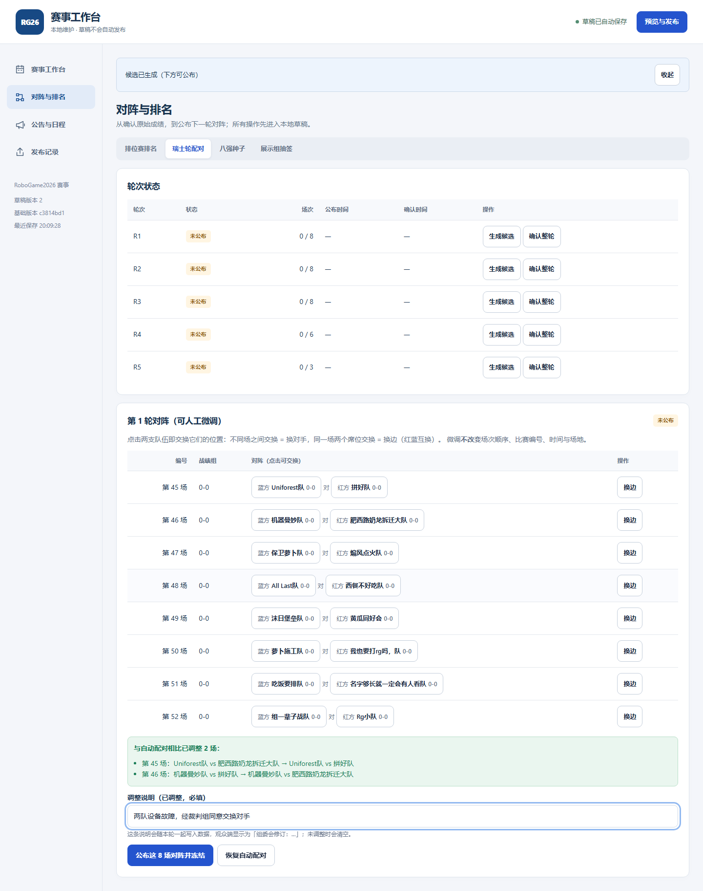

# 2026-10-03 瑞士轮对阵人工微调（组委会处置特殊情况）

## 需求

> 因为一些特殊情况的出现, 我希望瑞士轮实际的对阵情况能在自动生成的对阵表上微调.

自动配对是按手册算出来的**建议**；现场会出现手册没有预设的情况（设备故障、同校回避、
场地冲突……）。此前只有一条路：要么照自动配对公布，要么在页面之外口头说明。
后者会让观众看到的对阵与现场实际进行的比赛不一致。

## 方案

**在自动生成的候选对阵表上直接改"谁对谁"，改完再公布。** 写入路径只有一条：
候选对阵与微调后的对阵形状完全相同（`PairingPair`），`publishRound` 只换 `pairs` 的来源。

| 能力 | 说明 |
| --- | --- |
| 交换席位 | 点击两支队伍即交换：不同场之间 = 换对手；同一场两席位 = 换边（红蓝互换）；每行另有“换边”按钮 |
| 按编号叫场 | 表格与所有提示都用**全局比赛编号**（第 45–52 场…），与现场对讲机、赛程卡片一致；编号由赛制派生，微调不改编号 |
| 结构校验 | 每队恰好出场一次、无自我对阵、无重复对阵、场次数与手册一致、战绩组与组内序号合法 |
| 跨组调整 | 允许（只给黄色提示，不阻断）：特殊情况下的跨组正是需要人介入的场合 |
| 必须留痕 | 与自动配不同就必填“调整说明”，写入 `swiss.rounds[].revisionNote`，观众端显示「组委会修订：…」 |
| 已公布也可改 | 本轮已公布但**未开赛**时可“重新公布”，`pairingVersion` 递增；开赛后一律拒绝（走更正流程） |
| 门禁不可绕过 | 上一轮未结束、排位赛名次未成立等**门禁阻断**与“配对构成问题”分开报告，后者才可人工解决 |

**微调不改变**场次顺序、比赛编号、时间与场地：换对手不该把比赛挪到别的时间。
轮空／合并场次属于赛程决定，明确不在本功能范围内（界面与报错都会说明）。

## 设计要点

- **门禁与构成问题分开**（`src/domain/swiss.ts`）：`PairingProposal` 拆成
  `blockers`（门禁，任何人不得绕过）与 `compositionIssues`（组内奇数、场次数不符、
  自我对阵、重复对阵——可由人工微调后公布）。此前两者混在一个 `blockers` 里，
  结果是“自动配不出来就永远发布不了”，即使组委会已经有决定。
- **校验基准是本轮参赛名单**：`participantTeamIds`（R1 = 晋级 16 队，R2+ = 仍在比赛中的队伍）
  必须各出现恰好一次。名单与门禁一起由领域层给出，界面不自己推断。
- **公布前再校验一次**（`publishRound` → `checkPairingAdjustment`）：界面禁用按钮只是体验，
  真正的门在写入路径上；绕过界面直接调用同样会被拒绝。
- **数据层兜底**（`src/domain/validation.ts`）：新增错误 `duplicate-participant-in-round`
  （一轮内同一队出场两次）与提示 `republished-without-note`（重发过但没有修订说明）。
  即使有人直接改 `data/event.json`，`validate:data` 也会拦住结构错误。
- **纯函数原语**（`swapPairingSlots`）：任何排列都能由交换得到，因此不需要第二套编辑模型；
  越界或过期下标原样返回，不抛错。

## 改动文件

- `src/domain/swiss.ts`：`PairingPair`/`PairingSlotRef`/`PairingAdjustment` 类型、
  `swapPairingSlots`、`checkPairingAdjustment`、`PairingProposal` 拆分布局与
  `participantTeamIds`/`expectedMatchCount`；`proposalToMatchSkeletons` 改为只要求
  `{roundIndex, pairs}`，候选与微调共用一条写入路径。
- `src/operator/draft.ts`：`publishRound(event, roundIndex, proposal, adjustment?)`；
  `publishedRoundPairs`（回读已公布对阵，作为编辑器起点）；`generateNextRound` 的 `published` 字段。
- `src/operator/PairingPanel.tsx`（新）：对阵微调编辑器（席位按钮、差异列表、说明必填、
  恢复自动配对、载入当前已公布对阵、跨组徽标）。
- `src/operator/PlanningPanels.tsx`：候选面板换成 `RoundPairingPanel`。
- `src/domain/validation.ts`：轮内重复出场（错误）与重发无说明（提示）。
- `src/operator/operator.css`：席位按钮样式。
- 文档：`docs/RULES.md`（新「人工微调实际对阵」）、`docs/OPERATOR_GUIDE.md`（操作步骤）、
  `docs/README.md`（本记录）。

## 验证

| 检查 | 结果 |
| --- | --- |
| 类型检查 / Lint | ✅ |
| 单元测试 | ✅ **428 项**（新增 `tests/domain/swiss-adjustment.test.ts` 18 项：交换原语、六类结构校验、跨组提示、写入与四类拒绝、开赛后拒绝、回读版本） |
| 观众端 e2e | ✅（新增 `tests/e2e/swiss-adjustment.spec.ts`：微调后的对阵确实被采用、观众看到实际对手与「组委会修订」、比赛编号不变） |
| 工作台 e2e | ✅（新增用例走完整链路：定榜 → 生成候选 → 点击交换 → 说明必填 → 公布 → 核对落库数据 → 恢复自动配对后重发清空说明） |
| `validate:data` | ✅ 正式数据 0 错误 0 提示（历史数据不受影响） |
| `check:integration` / `check:robustness` | ✅ 通过 / 132 项 |

### 反证（证明这些测试真的在守东西）

| 故意改坏的地方 | 失败断言 |
| --- | --- |
| `publishRound` 忽略 `adjustment`（照旧写自动配对） | 单元 2 项：写入的对阵、回读的版本/说明 |
| `checkPairingAdjustment` 的轮内重复出场降级/删除 | `special-results` 的“弃权累计 3 胜”用例（该场景人为让同队出场 3 次） |
| 构成问题重新塞回 `blockers` | `swiss.test.ts` D18「退赛造成分组奇数」 |
| 微调编辑器点击后不交换（`setPairs(pairs)`） | 工作台 e2e：调整列表与落库对阵 |

## 边界与未验证项

- **轮空 / 人数不足**：不实现。若某组人数为奇数，自动配对仍会报构成问题，人工微调也要求
  场次数与手册一致；确实需要轮空或改变场次数量属于组委会的赛程决定，需要另行改动
  校验与数据模型（`unexpected-match-count` 目前是阻断错误）。
- **开赛后的修改**：一律拒绝（本项目既有口径：改用更正流程记录处置）。
- **浏览器矩阵**：本机只跑了 Chromium（观众端 desktop-chromium、工作台 operator-chromium）；
  WebKit 与移动端项目由 CI 覆盖。
